# One-Body Trajectory Optimization

This project simulates the optimal trajectory of a free-body. The spacecraft dynamics is free or uses no external acceleration. The optimal control law uses an indirect method, leveraging the Hamiltonian. The flight time is fixed and boundary conditions are fixed. The spacecraft travels from a fixed position and velocity to a fixed position and velocity. 

## Project Structure

```
one_body_trajectory_optimization/
├── input/
│   └── example/
│       ├── 01_minenergy_uncon.json
│       ├── 02_minenergy_thrustaccmax.json
│       ├── 03_minenergy_thrustmax.json
│       ├── 04_minfuel_thrustaccmax.json
│       ├── 05_minfuel_thrustmax.json
│       ├── 06_minenergy_uncon_timefree.json
│       └── 07_minfuel_thrustmax_timefree.json
├── output/
│   └── example/
├── src/
│   ├── data/
│   ├── initial_guess/
│   │   └── guesser.py
│   ├── load/
│   │   ├── configurer.py
│   │   ├── parser.py
│   │   ├── processor.py
│   │   └── reader.py
│   ├── model/
│   │   └── dynamics.py
│   ├── optimize/
│   │   └── optimizer.py
│   ├── plot/
│   │   └── final_results.py
│   └── utility/
│       └── bounding_functions.py
├── tests/                        : collection of tests
├── untracked/                    : untracked files for convenience
├── .gitignore                    : contains files and folders to ignore by git
├── main.py                       : main driver
├── README.md                     : documentation
└── requirements.txt              : required external packages
```

## Installation

To install the required external packages, run the following command:
```
pip install -r requirements.txt
```

## Usage

To run the program, change directory to `one_body_trajectory_optimization`:
```
cd ~/github/spacecraft-trajectory-problems/one_body_trajectory_optimization/
```
Execute the following general command
```
python main.py <input_filepath> [<output_folderpath>]
```
See section Examples for more details.

## Dependencies

This project requires the following Python packages:
```
argparse==1.4.0
astropy==6.0.1
matplotlib==3.9.4
numpy==1.26.4
pytest==8.3.2
scipy==1.13.1
```

## Examples

### Example 1.01: `input/example/1.01_energy_thrustaccmax.json`
```
python main.py input/example/1.01_energy_thrustaccmax.json
```
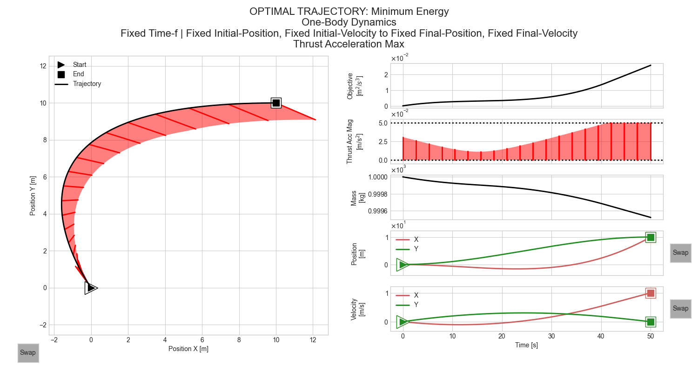

### Example 1.02: `input/example/1.02_energy_thrustmax.json`
```
python main.py input/example/1.02_energy_thrustmax.json
```
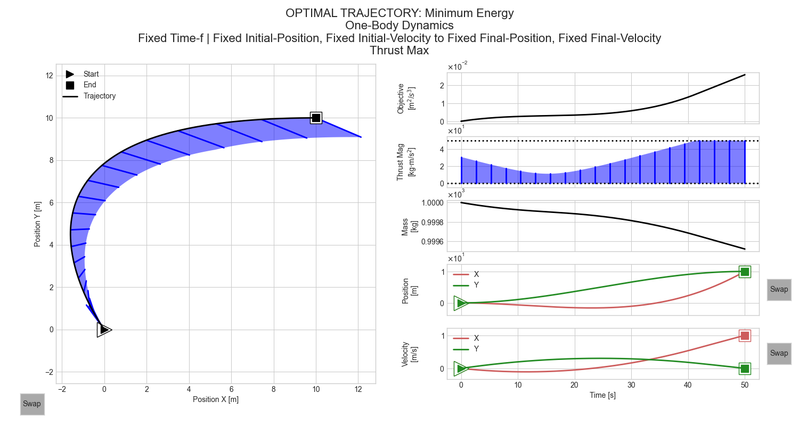

### Example 1.03: `input/example/1.03_fuel_thrustaccmax.json`
```
python main.py input/example/1.03_fuel_thrustaccmax.json
```
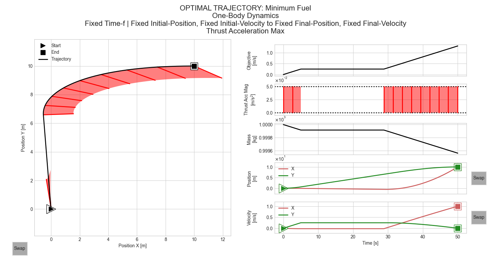

### Example 1.04: `input/example/1.04_fuel_thrustmax.json`
```
python main.py input/example/1.04_fuel_thrustmax.json
```
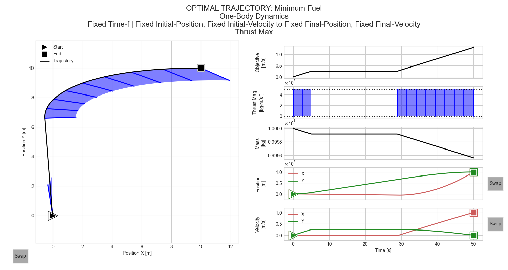

### Example 1.05: `input/example/1.05_energyfuel_thrustaccmax.json`
```
python main.py input/example/1.05_energyfuel_thrustaccmax.json
```


### Example 1.06: `input/example/1.06_energyfuel_thrustmax.json`
```
python main.py input/example/1.06_energyfuel_thrustmax.json
```


### Example 1.07: `input/example/1.07_energyfuel_thrustmax_gravity.json`
```
python main.py input/example/1.07_energyfuel_thrustmax_gravity.json
```
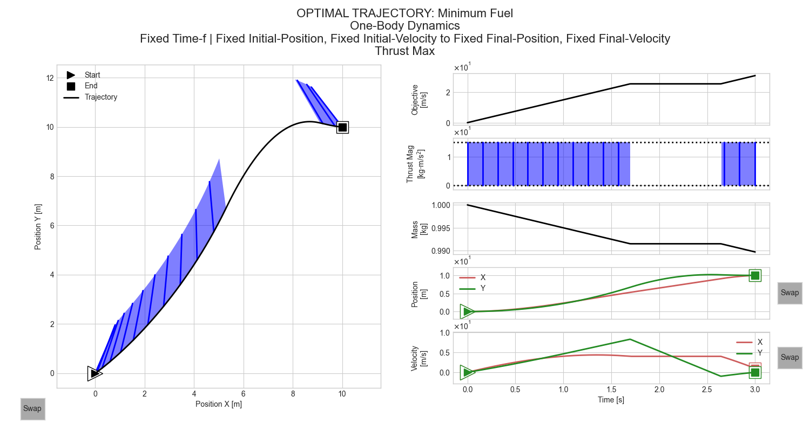

### Example 1.08: `input/example/1.08_energy_uncon_timefree.json`
```
python main.py input/example/1.08_energy_uncon_timefree.json
```
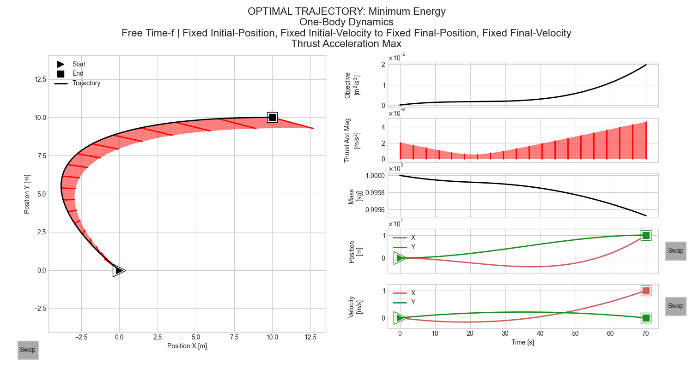

### Example 2.01: `input/example/2.01_fuel_thrustaccmax_falcon9.json`
```
python main.py input/example/2.01_fuel_thrustaccmax_falcon9.json
```
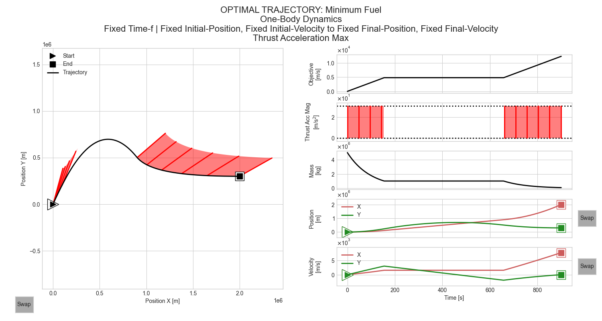

### Example 2.02: `input/example/2.02_energy_thrustmax_falcon9.json`
```
python main.py input/example/2.02_energy_thrustmax_falcon9.json
```
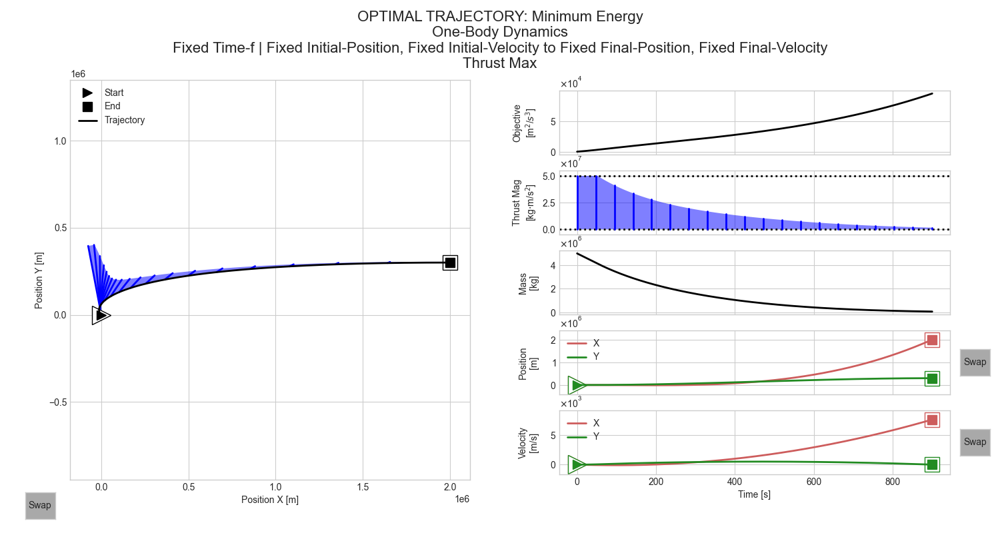

### Example 3.01: `input/example/3.01_energy_uncon_timefree.json`
```
python main.py input/example/3.01_energy_uncon_timefree.json
```
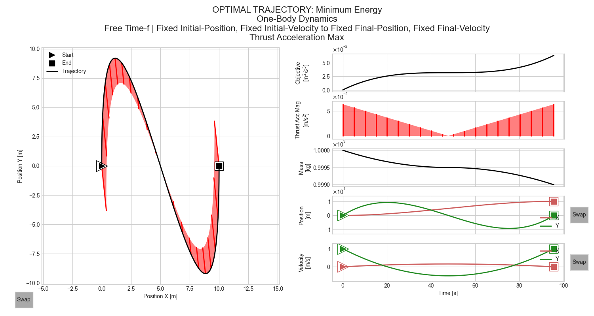

### Example 3.02: `input/example/3.02_energy_uncon.json`
```
python main.py input/example/3.02_energy_uncon.json
```
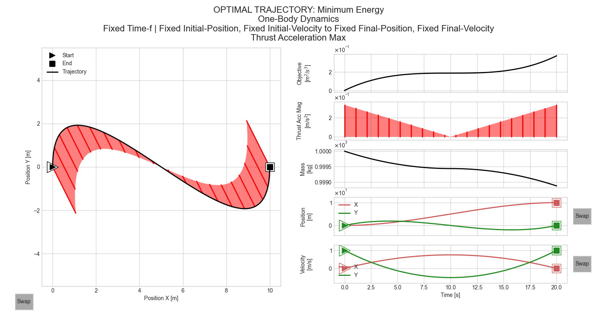

### Example 4.01: `input/example/4.01_fuel_thrustaccmax.json`
```
python main.py input/example/4.01_fuel_thrustaccmax.json
```
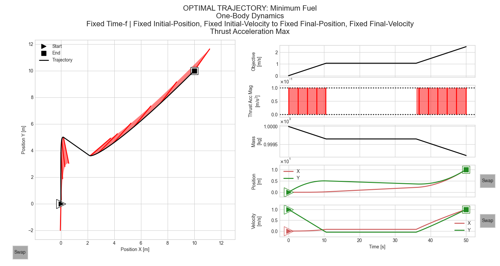

### Example 5.01: `input/example/5.01_fuel_thrustaccmax.json`
```
python main.py input/example/5.01_fuel_thrustaccmax.json
```
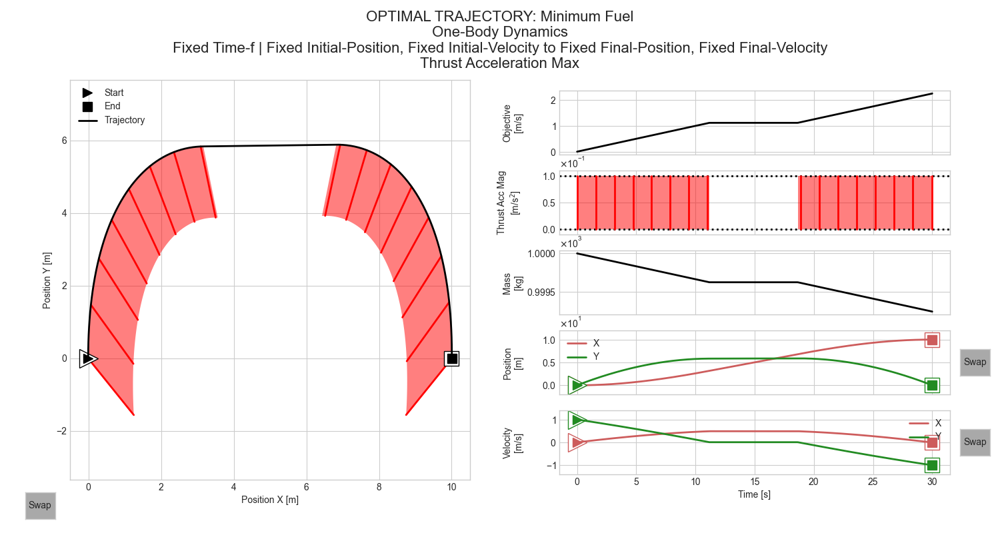

### Example 5.02: `input/example/5.02_fuel_thrustmax.json`
```
python main.py input/example/5.02_fuel_thrustmax.json
```
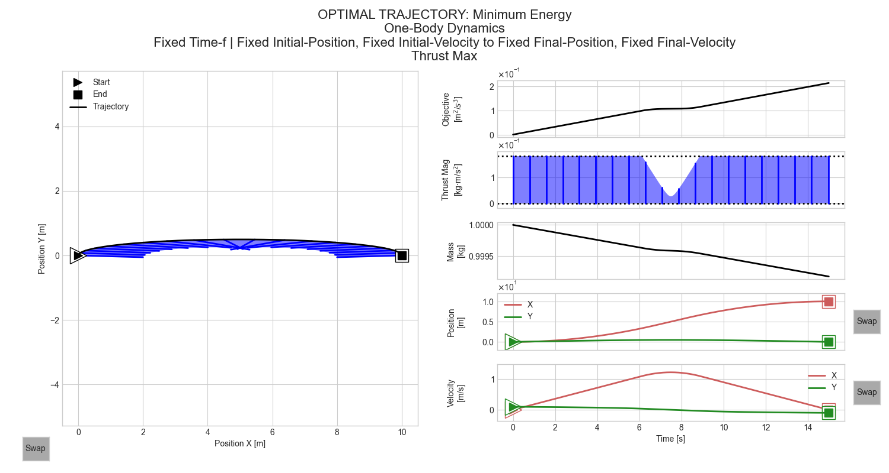

### Example 5.03: `input/example/5.03_fuel_thrustmax.json`
```
python main.py input/example/5.03_fuel_thrustmax.json
```
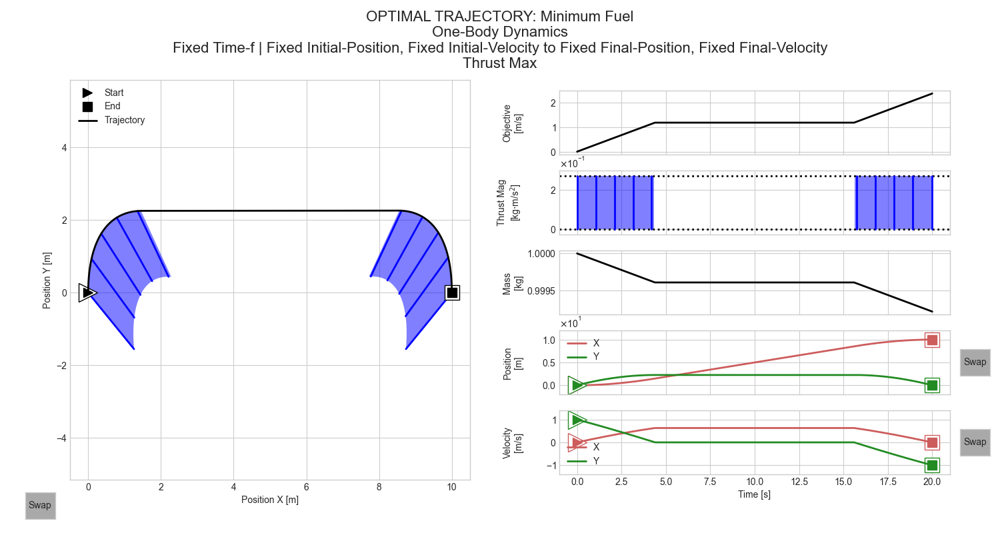

---
## Optimal Control Problem 

### Summary

| System <br> Component | <br> Symbol | Minimization <br> Type | <br> Expressions | | |
| :- | :- | :- | :- | :- | :- |
| Objective | $J$ | fuel | $J = \int \ L \ dt = \int_{t_o}^{t_f} \ \Gamma \ dt$ | | |
| | | energy | $J = \int \ L \ dt = \int_{t_o}^{t_f} \tfrac{1}{2} \Gamma^2 \ dt$ | | |
| Timespan | $t$ | | $t \in [t_o \ \ \ t_f]$ | | |
| State | $\vec{x}(t)$ | | $\vec{x} = [ \vec{r}^\top \ \ \ \vec{v}^\top ]^\top$ | | |
| Co-State | $\vec{\lambda}(t)$ | | $\vec{\lambda} = [ \vec{\lambda}_r^\top \ \ \ \vec{\lambda}_v^\top ]^\top$ | | |
| Control | $\vec{u}(t)$ | fuel | $\vec{u} = \vec{\Gamma} = \Gamma \hat{\Gamma}$ | $\Gamma = \Gamma_{\text{fuel}}$ | $\hat{\Gamma} = -\vec{\lambda}_v / \lambda_v$ |
| | | energy | $\vec{u} = \vec{\Gamma} = \Gamma \hat{\Gamma}$ | $\Gamma = \Gamma_{\text{energy}}$ | $\hat{\Gamma} = -\vec{\lambda}_v / \lambda_v$ |
| Dynamics | $\vec{f}(t,\vec{x},\vec{u})$ | | $\vec{f} = [ \vec{v}^\top \ \ \ \vec{\Gamma}^\top ]^\top$ | | |
| Co-Dynamics | $\vec{g}(t,\vec{x},\vec{u})$ | | $\vec{g} = [ \vec{0}^\top \ \ \ -\vec{\lambda}_r^\top ]^\top$ | | |
| Equality Constraints | | | $t_o=t_{os}$ | $\vec{r}(t_o)={\vec r}_{os}$ | $\vec{v}(t_o)={\vec v}_{os}$ |
| | | | $t_f=t_{fs}$ | $\vec{r}(t_f)={\vec r}_{fs}$ | $\vec{v}(t_f)={\vec v}_{fs}$ |
| Inequality Constraints | | fuel | $\Gamma_{\min} \leq \Gamma_{\text{fuel}} \leq \Gamma_{\max}$ | or $T_{\min}/m \leq \Gamma_{\text{fuel}} \leq T_{\max}/m$ | |
| | | energy | $\Gamma_{\min} \leq \Gamma_{\text{energy}} \leq \Gamma_{\max}$ | or $T_{\min}/m \leq \Gamma_{\text{energy}} \leq T_{\max}/m$ | or $0 \leq \Gamma_{\text{energy}} \leq \infty$ |

### Derivation

#### Objective and State
The optimal control problem is solved using an indirect method. The objective $J$ minimizes fuel and energy as follows, respectively:
```math
\begin{array}{llll}
& \text{fuel}   : & J & = & \int \ L \ dt = \int_{t_o}^{t_f} \              \Gamma   \ dt \\
& \text{energy} : & J & = & \int \ L \ dt = \int_{t_o}^{t_f} \ \tfrac{1}{2} \Gamma^2 \ dt
\end{array}
```
The state of the one body is representead in a Cartesian xy-system with respect to an inertial frame
```math
\vec{x} = [ \vec{r}^\top \ \ \ \vec{v}^\top ]^\top = [ r_x \ \ \ r_y \ \ \ v_x \ \ \ v_y ]^\top
```
where $\vec{r} = [ r_x \ \ \ r_y ]^\top$ is position and $\vec{v} = [ v_x \ \ \ v_y ]^\top$ is velocity.

#### Hamiltonian Formulation
The indirect method means to derive the optimal control law by minimizing a Hamiltonian $H$. The derivatives of the Hamiltonian provide the necessary, but not sufficient, conditions for a minimum solution. The Hamiltonian is a function of the integrand $L$ of the objective $J$, state $\vec{x}$, co-state $\vec{\lambda}$, dynamics $\vec{f}$, and control $\vec{u}$. In particular, the co-state in component form is $\vec{\lambda} = \left[ \lambda_{r_x} \ \ \ \lambda_{r_y} \ \ \ \lambda_{v_x} \ \ \ \lambda_{v_y} \right]^\top$ and the control. The Hamiltonian $H$ is
```math
H = L + \vec{\lambda}^\top \vec{f}(t, \vec{x}, \vec{u})
```
For minimization of of fuel and energy, $L = \Gamma$ and $\frac{1}{2} \vec{\Gamma}^\top \vec{\Gamma}$, respectively. Substituting into the Hamilitonian yields for fuel minimization
```math
H = \Gamma + \vec{\lambda}_r^\top \vec{v} + \vec{\lambda}_v^\top (g \hat{y} + \vec{\Gamma})
  = \Gamma + \lambda_{r_x} v_x + \lambda_{r_y} v_y + \lambda_{v_x} \Gamma_x + \lambda_{v_y} (g + \Gamma_y)
```
and for energy minimization
```math
H = \frac{1}{2} \vec{\Gamma}^\top \vec{\Gamma} + \vec{\lambda}_r^\top \vec{v} + \vec{\lambda}_v^\top (g \hat{y} + \vec{\Gamma})
  = \frac{1}{2} \left( \Gamma_x^2 + \Gamma_y^2 \right) + \lambda_{r_x} v_x + \lambda_{r_y} v_y + \lambda_{v_x} \Gamma_x + \lambda_{v_y} (g + \Gamma_y)
```

#### Necessary Conditions for Optimality
Using the Hamiltonian, we derive the necessary conditions for optimality using Pontryagin's Minimum Principle. The Hamiltonian-minimizing conditions are 
the dynamical state equations $\dot{\vec{x}} = ( dH / d\vec{\lambda} )^\top$, 
the co-state dynamical equations $\dot{\vec{\lambda}} = -( dH / d\vec{x} )^\top$, and 
the optimal control $dH / d\vec{u} = \vec{0}^\top$.

##### State Dynamical Equations
The one-body dynamics $\dot{\vec{x}} = \vec{f}$ are free from natural acceleration with control as thrust acceleration, $\vec{\Gamma} = [ \Gamma_x \ \ \ \Gamma_y ]$. These state dynamics are also given by $\dot{\vec{x}} = ( dH / d\vec{\lambda} )^\top$:
```math
\begin{align}
&\dot{r}_x = \frac{dH}{d\lambda_{r_x}} &\to &\dot{r}_x = v_x \\
&\dot{r}_y = \frac{dH}{d\lambda_{r_y}} &\to &\dot{r}_y = v_y \\
&\dot{v}_x = \frac{dH}{d\lambda_{v_x}} &\to &\dot{v}_x = \Gamma_x \\
&\dot{v}_y = \frac{dH}{d\lambda_{v_y}} &\to &\dot{v}_y = g + \Gamma_y \\
\end{align}
```
Mass is not needed as an explicit state variable, but it needs to be integrated along with the state to model thrust, $T = \Gamma m$. The time-derivative of mass is
```math
\dot{m} = -\frac{\Gamma m}{c_{\text{ev}}}
```
where $c_{\text{ev}}$ is the exhaust velocity of the engine, assumed constant.

##### Co-state Dynamical Equations
The co-state dynamics are given by $\dot{\vec{\lambda}} = -\left( dH/d\vec{x} \right)^\top$:
```math
\begin{align}
&\dot{\lambda}_{r_x} = -\frac{dH}{dr_x} &\to &\dot{\lambda}_{r_x} = 0              \\
&\dot{\lambda}_{r_y} = -\frac{dH}{dr_y} &\to &\dot{\lambda}_{r_y} = 0              \\
&\dot{\lambda}_{v_x} = -\frac{dH}{dv_x} &\to &\dot{\lambda}_{v_x} = -\lambda_{r_x} \\
&\dot{\lambda}_{v_y} = -\frac{dH}{dv_y} &\to &\dot{\lambda}_{v_y} = -\lambda_{r_y}
\end{align}
```

##### Optimal Control
The optimal control $\vec{u}_*$ must minimize the Hamiltonian. This condition is found by setting the derivative of the Hamiltonian with respect to the control to zero, $dH/d\vec{u} = \vec{0}^\top$. The minimum-fuel control-law derivation is first and the minimum-energy law is second. 

###### Minimum Fuel
For mininum fuel, represent the control as a magnitude and direction, $\vec{\Gamma} = \Gamma \hat{\Gamma}$. Both must be determined. Subsitute this representation into $H$ and rearrange:

```math
\begin{array}{lll}
H & = & \Gamma + \vec{\lambda}_r^\top \vec{v} + \vec{\lambda}_v^\top (g \hat{y} + \Gamma \hat{\Gamma}) \\
  & = & \vec{\lambda}_r^\top \vec{v} + \vec{\lambda}_v^\top (g \hat{y}) + \Gamma (1 + \vec{\lambda}_v^\top \hat{\Gamma}) 
\end{array}
```

To minimize this $H$, consider the control-dependent term, $\Gamma (1 + \vec{\lambda}_v^\top \hat{\Gamma})$. The two cases for $\Gamma$ are when it is and is not zero:
- If $\Gamma = 0$, then there is no thrust direction and thus the term $\Gamma (1 + \vec{\lambda}_v^\top \hat{\Gamma}) = 0$.
- If $\Gamma > 0$, then $\vec{\lambda}_v^\top \hat{\Gamma}$ must be minimized. The dot product for this term can be expressed as
```math
\vec{\lambda}_v^\top \hat{\Gamma} = \|\vec{\lambda}_v\| \|\hat{\Gamma}\| \cos(\theta) = \lambda_v \cos(\theta)
```
where $\theta$ is the angle between the vectors $\vec{\lambda}_v$ and $\hat{\Gamma}$. The minimum is associated with $\cos(\theta) = -1$, so $\vec{\lambda}_v^\top \hat{\Gamma} = -\lambda_v$ and thus the optimal thrust-acceleration direction is 
```math
\hat{\Gamma}_{\text{fuel}*} = -\frac{\vec{\lambda}_v}{\lambda_v}
```

For thrust-acceleration magnitude $\Gamma$, substitute thrust-acceleration direction $\hat{\Gamma}$ into $H$ to yield
```math
\begin{array}{lll}
H & = & \vec{\lambda}_r^{\top} \vec{v} + \vec{\lambda}_v^\top (g \hat{y}) + \Gamma ( 1 + \vec{\lambda}_v^{\top} \left( -\frac{\vec{\lambda}_v}{\lambda_v} \right) ) \\
  & = & \vec{\lambda}_r^{\top} \vec{v} + \vec{\lambda}_v^\top (g \hat{y}) - \Gamma (\lambda_v - 1) \\
  & = & \vec{\lambda}_r^{\top} \vec{v} + \vec{\lambda}_v^\top (g \hat{y}) - \Gamma S
\end{array}
```

This switching function $S = \lambda_v - 1$ governs. If $S$ is positive or negative, $\Gamma$ ought to be maximized or minimized, respectively:

```math
\Gamma_{\text{fuel}*} = 
\begin{cases}
\Gamma_{\max}        & S > 0 \\
\Gamma_{\min}        & S < 0 \\
\text{indeterminate} & S = 0
\end{cases}
```

In practice, for the instant $S = 0$, $\Gamma_{\text{fuel}} = \Gamma_\min$ as a choice. All together, 
```math
\vec{\Gamma}_{\text{fuel}*} = \Gamma_{\text{fuel}*} \hat{\Gamma}_{\text{fuel}*}
```
is known for the minimization of fuel.

###### Minimum Energy
For minimum energy, the control law derivation is much simpler. Take the derivative of $H$ with respect to $\vec{\Gamma}$ to yield the optimal control law
```math
\frac{dH}{d\vec{\Gamma}} = \vec{0}^\top \to \vec{\Gamma} + \vec{\lambda}_v = \vec{0} \to \vec{\Gamma}_{\text{energy}*} = -\vec{\lambda}_v
```
Convenient for inequality constraint application, the optimal control law for energy in magnitude and direction form is
```math
\vec{\Gamma}_{\text{energy}*} \ \ \ = \ \ \ \Gamma_{\text{energy}*} \hat{\Gamma}_{\text{energy}*}
```
where
```math
\begin{array}{ll}
& \Gamma_{\text{energy}*} & = & \lambda_v \\
& \hat{\Gamma}_{\text{energy}*} & = & -\frac{\vec{\lambda}_v}{\lambda_v} \\
\end{array}
```

#### Equality Constraints: Flight Time, Initial Position and Velocity, Final Position and Velocity

The equality conditions or boundary conditions are variable.
- Flight time is $\Delta t = t_f - t_o$, where $t_o$ and $t_f$ are initial and final time. If both $t_o$ and $t_f$ are fixed, $\Delta t$ is fixed. Otherwise flight time is free. 
- Initial position and velocity are either fixed or free (specified or not, respectively):
```math
\vec{r}(t_o)=\vec{r}_{os} \ \ \ \text{and} \ \ \ \vec{v}(t_o)=\vec{v}_{os}
```
- Final position and velocity are either fixed or free (specified or not, respectively):
```math
\vec{r}(t_f)=\vec{r}_{fs} \ \ \ \text{and} \ \ \ \vec{v}(t_f)=\vec{v}_{fs}
```

#### Inequality Constraints: Thrust and Thrust-Acceleration

The inequality conditions are variables as well. Thrust as a force and or thrust as acceleration can be constrained between a minimum and maximum. If thrust acceleration is constrained, specified min and max, $\Gamma_{\text{min},s}$ and $\Gamma_{\text{max},s}$, are used. If thrust as a forcee is constrained, specified min and max, $T_{\text{min},s}$ and $T_{\text{max},s}$, are used. Mass is integrated along with the state $\vec{x}$ to map the thrust-force constraint to a thrust acceleration:
```math
\begin{array}{llll}
\Gamma_{\text{min}} = 
\begin{cases}
\Gamma_{\text{min},s}     & S < 0 & \text{and if using thrust-acceleration constraints} \\
     T_{\text{min},s} / m & S < 0 & \text{and if using thrust constraints}
\end{cases}
\end{array}
```
```math
\begin{array}{llll}
\Gamma_{\text{max}} = 
\begin{cases}
\Gamma_{\text{max},s}     & S > 0 & \text{and if using thrust-acceleration constraints} \\
     T_{\text{max},s} / m & S > 0 & \text{and if using thrust constraints}
\end{cases}
\end{array}
```

In practice, for fuel-minimization problems, thrust-acceleration is smoothly applied using a hyperbolic tangenent function $\tanh$. As input, the switching function $S$ is scaled with factor $k$ to better approximate the optimal bang-bang thrust:
```math
\Gamma_{\text{fuel}} = 
\Gamma_\min + (\Gamma_\max - \Gamma_\min) \left( \frac{1}{2} + \frac{1}{2} \tanh(k S) \right) \ \ \ k = 1 \to \infty
```

Similarly, for energy-minization problems, thrust-acceleration, or thrust-force mapped to thrust acceleration, is smoothly constrained with a smoothing min and max function, $\text{smin}$ or $\text{smax}$:
```math
\begin{array}{llll}
\Gamma_{\text{energy}} = 
\begin{cases}
\lambda_v                                                                                  & \text{if unconstrained} &              \\
\text{smin}\left(\text{smax}(\lambda_v,\Gamma_{\text{min}},k),\Gamma_{\text{max}},k\right) & \text{if constrained}   & k \to \infty
\end{cases}
\end{array}
```
where
```math
\begin{array}{ll}
& \text{smin}(a_1, a_2, k) & = & \frac{-1}{k} \left( b + \ln(e^{-k a_1 - b} + e^{-k a_2 - b}) \right) \\
& \text{smax}(a_1, a_2, k) & = & \frac{ 1}{k} \left( b + \ln(e^{ k a_1 - b} + e^{ k a_2 - b}) \right)
\end{array}
```
and 
```math
b = \text{max}(k a_1, k a_2)
```

---
